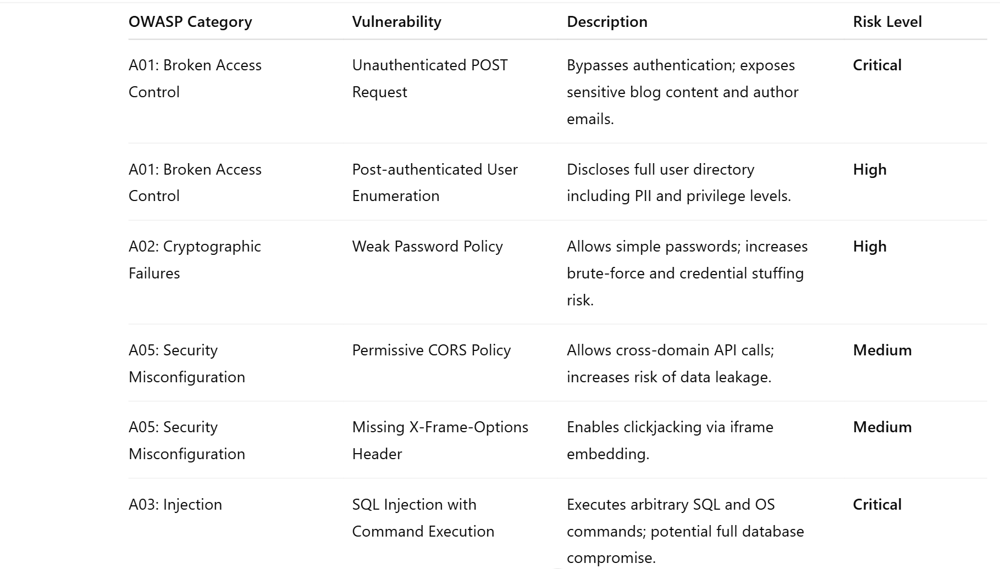
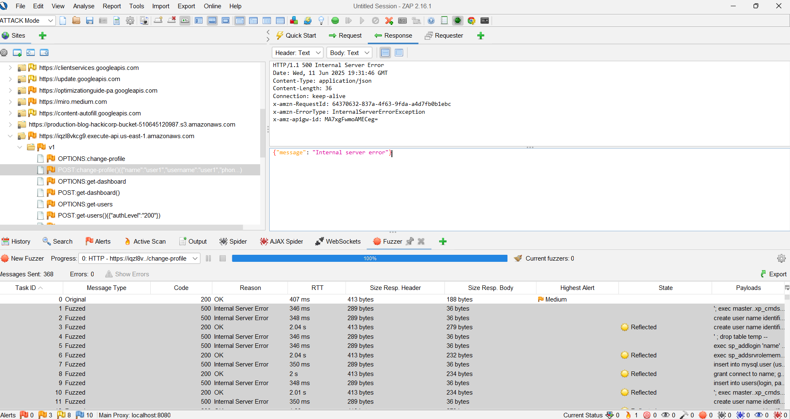

# Cybersecurity Risk Assessment

## Objective

This project involved assessing the cybersecurity posture of a simulated client website. The objective was to identify vulnerabilities, evaluate risk levels, and provide actionable recommendations using industry-standard tools and frameworks. The focus was on aligning findings with best practices in Governance, Risk, and Compliance (GRC).

### Skills Learned
Over a two-week period, I conducted a hands-on risk assessment of a live cloud-based web application. Key activities included:
- Researching global and industry-specific cyber threats.
- Conducting automated and manual vulnerability scans.
- Mapping findings to the OWASP Top 10 framework.
- Creating a structured risk report with mitigation strategies.
- Delivering insights and recommendations in a formal presentation.

### Tools Used

- OWASP Zap – Vulnerability scanning
- Burp Suite – Manual web and API testing
- Wireshark – Packet analysis
- OWASP Top 10 – Risk classification framework
- Google Workspace / Docs – Report and presentation creation

### Skills Demonstrated

| Skill                              | Application Example                        |
| ---------------------------------- | ------------------------------------------ |
| Vulnerability Assessment           | Identified critical issues using OWASP Zap |
| Risk Prioritization & Reporting    | Structured risks by severity and impact    |
| OWASP Top 10 Analysis              | Mapped each vulnerability to known threats |
| GRC Understanding                  | Suggested policy and control improvements  |
| Communication of Security Findings | Presented detailed recommendations         |

### 🔎 Vulnerability Findings
The vulnerability assessment revealed multiple high- and critical-risk issues across key OWASP Top 10 categories. Below is a visual snapshot of our findings:

Key highlights include:

- 🔴 **Unauthenticated POST Request** (Critical): Exposes sensitive blog content and author emails without authentication.
- 🟠 **Post-authenticated User Enumeration** (High): Discloses full user directory including PII and privilege levels.
- 🟠 **Weak Password Policy** (High): Allows overly simple passwords, increasing the risk of brute-force and credential stuffing attacks.
- 🟡 **Permissive CORS Policy** (Medium): Allows cross-domain API calls, increasing the risk of unauthorized data access.
- 🟡 **Missing X-Frame-Options Header** (Medium): Enables clickjacking by allowing the site to be embedded in iframes.
- 🔴 **SQL Injection with Command Execution** (Critical): Allows arbitrary SQL and OS commands; full database compromise possible.

Each vulnerability was categorized according to the [OWASP Top 10](https://owasp.org/www-project-top-ten/) and evaluated based on its potential impact to the client's environment.

### 🚨 SQL Injection (Critical Severity)

**Issue**:  
The application allowed direct execution of unvalidated SQL queries, making it possible for an attacker to perform database operations — including reading, modifying, and potentially executing system-level commands.

**Impact**:  
This critical flaw can lead to **full database compromise** and even **remote code execution** through exploitation of functions like `xp_cmdshell`.

## 🔍 SQL Injection (Command Execution) – Proof of Concept

**Screenshot Description**  
This screenshot, taken from OWASP ZAP, shows fuzzing attempts made against the `/change-profile` endpoint using SQL injection payloads. The application consistently returns `500 Internal Server Error` responses for malformed SQL input, indicating that input is not properly sanitized before being processed by the backend database.

In the bottom panel, you can see several classic payloads like:
- `exec master..xp_cmdshell`
- `drop table temp --`
- `insert into users(...)`

These attempts reveal the backend database's failure to handle untrusted input safely. Even though no `200 OK` response is returned here, the repeated server errors triggered by malicious input strongly suggest that the application is vulnerable to SQL injection.

**Why this matters**  
- A successful SQL injection could allow an attacker to **read, modify, or delete database contents**.
- If command execution is enabled (e.g., via `xp_cmdshell`), the attacker could potentially achieve **remote code execution**, leading to full system compromise.

**Remediation Recommendations**
- Use parameterized queries and prepared statements.
- Sanitize and validate all user inputs.
- Implement error handling that returns generic messages to end users.
- Disable dangerous SQL server features like `xp_cmdshell`.

**Risk Level**: 🔴 **Critical**
